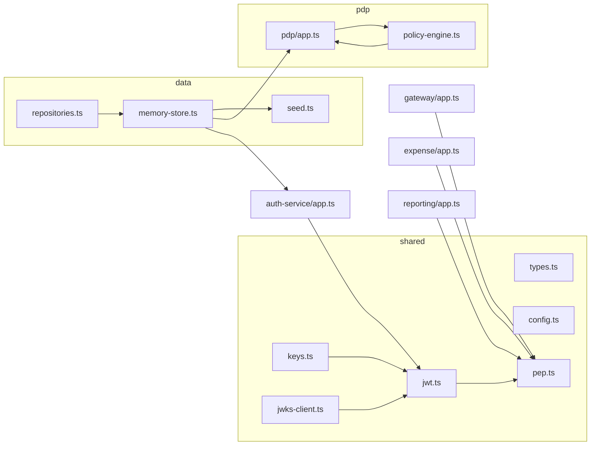

# Code Walkthrough

A file-by-file tour of the implementation. Read top-to-bottom and you'll understand how a
request flows from login to an audited allow/deny decision. Pair with
[DESIGN.md](DESIGN.md) for the *why* and [SIMULATION.md](SIMULATION.md) for the *proof*.

## Mental model in one diagram

---

## `src/shared/` — cross-cutting building blocks

### `types.ts`
The domain model and single source of truth for shapes: `Tenant`, `User`, `Role`, `Permission`,
`Condition`/`Clause` (the ABAC mini-DSL), `AuditEntry`, `AuthorizationRequest`/`Response`, and
`AccessTokenClaims`. Everything else imports from here. Note `Tenant.isolation: "pool" | "silo"`
— the hook for the premium isolation tier.

### `config.ts`
Ports, inter-service URLs (env-overridable for containers), `ACCESS_TTL_SECONDS` (15 min — the
baseline revocation mechanism), and `RATE_LIMITS` (the two token-bucket tiers).

### `rate-limiter.ts`
`TokenBucketLimiter` — an O(1) `{tokens, lastRefill}` bucket per key with an injectable clock (so
tests are deterministic), plus a `rateLimit(limiter, keyOf)` Express middleware that sets
`X-RateLimit-*` / `Retry-After`, returns `429`, and **fails open** when no key can be derived.
In-memory and per-process by design — see DESIGN §16.4 for the Redis/edge productionization.

### `keys.ts`
Generates one RSA keypair at startup. Exports the private `SIGNING_KEY` (auth only) and a
`jwks()` document (the public key, served to everyone). *Production: KMS/HSM + multiple keys for
rotation.*

### `jwt.ts`
`signAccessToken(claims)` → RS256 JWT with `kid`, issuer, audience, expiry. `verifyAccessToken`
decodes the `kid`, fetches the matching public key via the JWKS client, and verifies
signature + issuer + expiry. **Asymmetric: verifiers never hold a secret.**

### `jwks-client.ts`
Fetches and caches (`kid` → public key) from the auth service's `/.well-known/jwks.json`, with a
5-minute TTL. This is what lets independently deployed services/containers verify tokens, and how
key rotation propagates.

### `pep.ts` — the Policy Enforcement Point ⭐
Two middlewares:
- **`authenticate`** — pulls the bearer token, verifies it, attaches `req.principal` +
  `req.requestId` (correlation id). Runs at the gateway *and* in each service (defense in depth).
- **`enforce({resource, action, resourceId?, resourceAttributes?})`** — assembles the
  authorization request (including resource attributes for ABAC), calls the PDP, and enforces:
  PDP error → `503` (**fail closed**), `deny` → `403`, `allow` → `next()`. Services never decide
  for themselves.

---

## `src/data/` — persistence (behind interfaces)

### `repositories.ts` ⭐ the swap seam
Five interfaces: `TenantRepository`, `UserRepository`, `RoleRepository`, `AuditRepository`, and
`ExpenseRepository`. All reads are tenant-scoped by contract. Swapping to Postgres+RLS = implement
these once; the PDP and services don't change. The Expense service depends on `ExpenseRepository`,
so domain data sits behind the same seam as identity/policy data.

### `memory-store.ts`
In-memory implementation of the identity/policy repositories. **Every read filters by `tenantId`**
(e.g. `findUserById` returns nothing for a cross-tenant id) — the same invariant RLS enforces in
the DB. Audit is append-only (no update/delete by design). `newAuditEntry` stamps id + timestamp.

### `expense-store.ts`
In-memory `ExpenseRepository` (`InMemoryExpenseRepository`) + `seededExpenseRepository()` with the
demo expenses. `findById(tenantId, id)` is tenant-scoped, so the Expense service does no manual
tenant check — a cross-tenant id resolves to `undefined` → 404.

### `seed.ts`
Deterministic dataset: tenants **acme** and **globex**; roles admin/manager/employee +
`svc-reporting`; users alice/bob/carol (acme) and dave (globex); per-tenant reporting service
identities. This is where the RBAC+ABAC policy lives as data (e.g. employee `read` carries the
`resource.ownerId == $user.id` condition).

---

## `src/pdp/` — the Policy Decision Point

### `policy-engine.ts` ⭐ the core
`evaluate(roles, req, ctx)` — a **pure function**. Iterates the user's roles' permissions;
matches resource + action (with `*` wildcards); checks ABAC conditions via `resolvePath`
(dotted-path lookup) and `resolveOperand` (`$`-prefixed = context path). **Deny by default.**
No I/O → fast and unit-testable.

### `app.ts`
The PDP HTTP service. `POST /authorize` validates input, enforces tenant isolation (loads the
user *within* the tenant), assembles the context, calls `evaluate`, **writes an audit entry for
allow and deny alike**, and returns the decision. Also: `GET/PUT /tenants/:t/roles` (dynamic role
management) and `GET /tenants/:t/audit` (operational audit query).

---

## `src/auth-service/app.ts` — identity
- `POST /login` — verifies credentials, issues a user JWT.
- `POST /token` — client-credentials grant; resolves the **per-tenant service identity** so the
  token carries a least-privilege role (not admin).
- `GET /.well-known/jwks.json` — public keys for verification/rotation.
Constant-message auth errors avoid leaking which field was wrong.

## `src/gateway/app.ts` — the edge
Single entry point. `/api/auth/*` is public (you must be able to log in) and **rate-limited by IP**
(brute-force defense). Everything else under `/api` is `authenticate`d at the edge (PEP #1),
**rate-limited per `tenantId:userId`** (noisy-neighbor fairness), then reverse-proxied to the right
service, forwarding the bearer token + `x-request-id`. Authorization happens at the service PEP
(closest to the resource/attributes), keeping the gateway thin. Limit tiers are injectable via
`createGatewayApp(opts)` for testing.

## `src/services/expense/app.ts` — fine-grained ABAC
Takes an injected `ExpenseRepository` (`createExpenseApp(repo)`). Protected endpoints for
create/read/approve. The `loadExpense` middleware fetches the tenant-scoped resource via
`repo.findById(tenantId, id)` **before** `enforce`, so its `ownerId`/`department` feed the ABAC
condition; a cross-tenant id resolves to `undefined` → `404` (not 403), with no hand-written tenant
check. User routes require a user-audience token; `/internal/expenses` (service-to-service) requires
a service-audience token — both still authorized by the PDP.

## `src/services/reporting/app.ts` — cross-service + S2S
`GET /reports/expense-summary`: after passing its own `report:read` check, it (1) obtains a scoped
service token via client-credentials, (2) calls the expense service's internal endpoint with that
token + correlation id, (3) aggregates. Demonstrates zero-trust between services.

## `src/main.ts` — orchestrator
Boots all five services in one process for easy dev/test (auth + PDP share one seeded store).
`docker-compose.yml` shows the separate-container layout.

---

## `tests/` and `scripts/`

### `tests/policy-engine.test.ts`
Unit tests for the pure evaluator: deny-by-default, RBAC grant, ABAC own-record allow/deny,
department-scoped approve allow/deny, wildcard admin, reason text.

### `tests/integration.test.ts`
Boots the whole system and drives it over HTTP through the gateway: unauthenticated → 401,
bad token → 401, own-record read → 200, other's record → 403, dept approve → 200, cross-tenant
→ 404, cross-service report (S2S) → 200, audit entries recorded, dynamic role upsert.

### `scripts/demo.ts`
A narrated end-to-end run printing each decision — see [SIMULATION.md](SIMULATION.md) for the
captured output.
