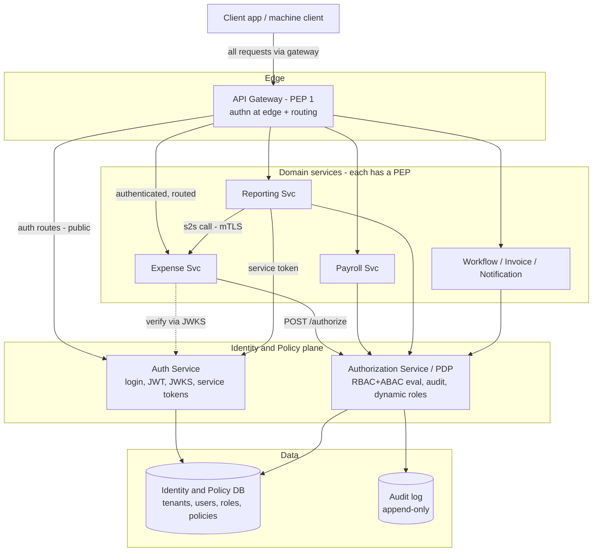
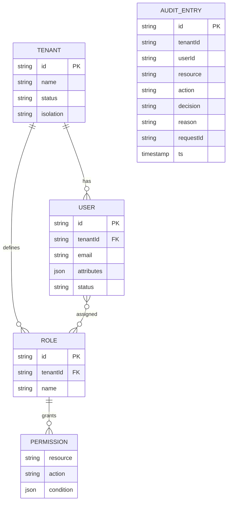
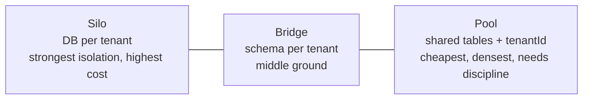
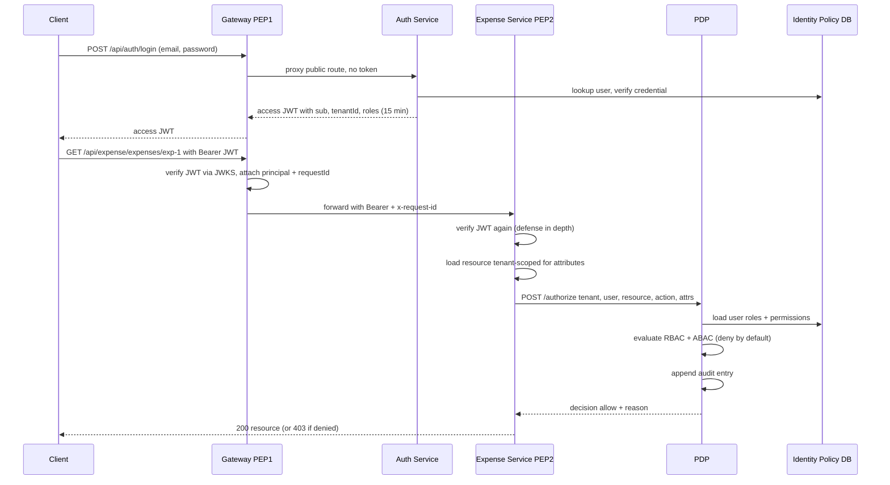
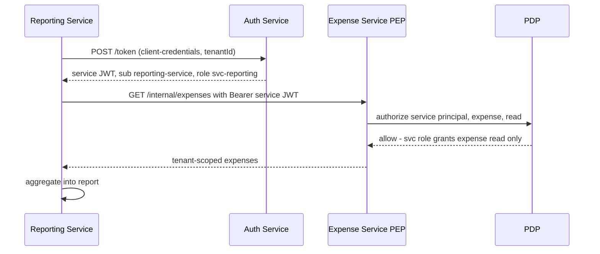
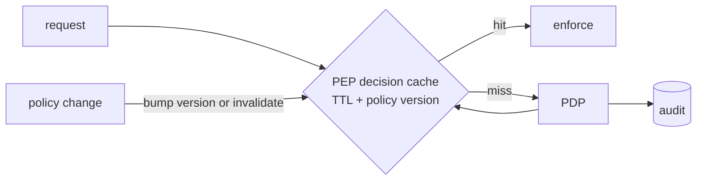
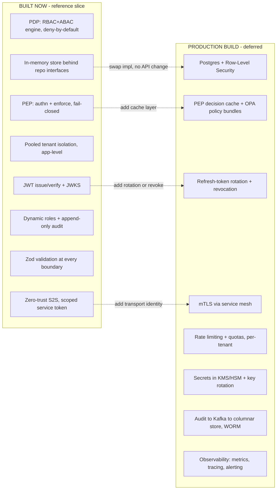

# Design Document: Access Control Across Microservices in a Multi-Tenant Architecture

> Companion to the runnable reference implementation in this repo. Diagrams are Mermaid and
> render directly on GitHub. For a file-by-file tour see [CODE_WALKTHROUGH.md](CODE_WALKTHROUGH.md);
> for a captured end-to-end run see [SIMULATION.md](SIMULATION.md).

## Table of contents
1. [Problem statement](#1-problem-statement)
2. [Assumptions](#2-assumptions)
3. [Requirements](#3-requirements)
4. [High-level design (HLD)](#4-high-level-design-hld)
5. [Access-control model](#5-access-control-model)
6. [Multi-tenant isolation](#6-multi-tenant-isolation)
7. [Authentication & authorization flows](#7-authentication--authorization-flows)
8. [Service-to-service security](#8-service-to-service-security)
9. [Low-level design (LLD)](#9-low-level-design-lld)
10. [APIs & data models](#10-apis--data-models)
11. [Scalability & reliability](#11-scalability--reliability)
12. [Security & compliance](#12-security--compliance)
13. [Operations](#13-operations)
14. [Tradeoffs & alternatives considered](#14-tradeoffs--alternatives-considered)
15. [Future roadmap](#15-future-roadmap)
16. [Implementation status: current vs production](#16-implementation-status-current-vs-production)
17. [Design concepts & patterns used](#17-design-concepts--patterns-used)

---

## 1. Problem statement

Design an enterprise-grade **access-control system** for a multi-tenant, microservices SaaS
platform (services: User Management, Expense, Payroll, Reporting, Workflow, Notification,
Invoice). Each tenant has its own users, org hierarchy, roles/permissions, and policies. The
platform must provide authentication, fine-grained authorization, tenant isolation,
cross-service and service-to-service authorization, dynamic role/permission management, and
auditability — at a scale of **thousands of tenants, millions of users, high throughput**.

The brief is deliberately open-ended. This document states assumptions, presents a concrete
architecture, justifies each decision, and discusses alternatives and tradeoffs. The
accompanying code implements a **vertical slice** (Auth, PDP, Gateway, Expense, Reporting) that
exercises every mechanism, so the design is demonstrably real rather than theoretical.

### Scope

**In scope:** identity & token issuance, the authorization model & decision engine, enforcement
across services, tenant isolation, service-to-service auth, audit, dynamic policy management,
and the scalability/security/ops reasoning around all of it.

**Designed but not built (time-boxed):** PEP-side decision caching + policy-bundle distribution;
Postgres + Row-Level Security persistence; refresh-token rotation, token-version revocation, and
mTLS service mesh. Each is isolated behind a seam so the swap is mechanical (see §9, §14).

---

## 2. Assumptions

| # | Assumption | Consequence |
|---|---|---|
| A1 | A **tenant** is an isolated customer org; a **user** belongs to exactly one tenant. | `tenantId` is a hard partition key on every entity and every decision. |
| A2 | All client traffic enters through the **API gateway**; internal services are not internet-reachable. | The gateway is the first PEP; services add a second layer (defense in depth). |
| A3 | We own all services (no third parties inside the trust boundary). | We can mandate mTLS + service tokens internally. |
| A4 | Authorization is **read-heavy** and latency-sensitive; correctness beats availability. | Cache aggressively; **fail closed** (deny on dependency failure). |
| A5 | Org hierarchy is shallow-to-moderate (departments, managers), not arbitrarily deep sharing graphs. | RBAC+ABAC suffices; full ReBAC (Zanzibar) is deferred (§5, §15). |
| A6 | Tenants range from small to large/regulated. | Tiered isolation: pooled by default, dedicated silo for premium (§6). |
| A7 | A leaked access token is the most likely credential incident. | Short token TTL + rotation + version-based revoke (§7, §12). |

---

## 3. Requirements

### Functional
- **FR1** Authenticate users and machine clients; issue and verify credentials.
- **FR2** Authorize every request against a `(subject, resource, action, context)` tuple.
- **FR3** Enforce tenant isolation on every data access and every authorization decision.
- **FR4** Support roles & permissions that are **editable at runtime**, per tenant.
- **FR5** Authorize service-to-service calls with scoped, least-privilege identities.
- **FR6** Produce an immutable, queryable audit record of every decision.

### Non-functional
| Attribute | Target | How it's met |
|---|---|---|
| **Authz latency** | p99 < 1 ms cached; < 10 ms on PDP round-trip | Stateless JWT verify + PEP decision cache (designed); pure in-memory evaluation |
| **Availability** | Authz path 99.99%; degrade **closed** | PDP replicated + cached at PEP; PEP denies on PDP failure |
| **Scale** | 10k+ tenants, 10M+ users, 100k+ authz/sec | Stateless services, JWT (no session store), partition by `tenantId`, read replicas |
| **Isolation** | No tenant can read/infer/affect another's data | Signed tenant claim + RLS + 404-not-403 |
| **Auditability** | 100% of decisions, tamper-evident, queryable | Append-only audit at the single PDP |
| **Change safety** | Policy changes take effect w/o redeploy, versioned | Roles/permissions are data; dynamic PDP API |

---

## 4. High-level design (HLD)

### 4.1 Component diagram



> **The gateway is the single entry point — clients never call any internal service (including
> auth) directly.** Login is a *public* route the gateway proxies to the auth service without
> requiring a token (you can't demand a token to obtain one); every other route requires a valid
> token at the edge. Token **issuance** lives in the auth service; token **verification** lives at
> the gateway and again in each service (defense in depth).

### 4.2 The five pillars (and why)

1. **Central PDP, distributed PEPs.** One Policy Decision Point owns evaluation logic + the
   audit trail; lightweight Policy Enforcement Points sit at the gateway and inside every
   service. This is the OPA/XACML "PDP/PEP" split and the model behind AWS IAM and Google
   Zanzibar. It prevents policy logic drifting across services, while enforcement stays close
   to the resource where ABAC attributes live. The latency cost is recovered with a PEP-side
   decision cache (§11).
2. **Token-based identity (JWT + JWKS).** The auth service signs short-lived JWTs; every service
   verifies signatures against the issuer's published JWKS — **no shared secret**, and rotation
   touches only the issuer.
3. **Hybrid RBAC + ABAC.** Roles for coarse access, attribute conditions for fine grain (§5).
4. **Pooled tenancy + defense-in-depth isolation,** with a silo tier for premium tenants (§6).
5. **Zero-trust service-to-service:** scoped service identities, mTLS transport, authorized by
   the same PDP (§8).

### 4.3 Request lifecycle (one sentence)

A client sends a JWT to the gateway → gateway verifies it (PEP #1) and routes → the service
verifies it again (defense in depth), loads the resource, and asks the PDP "may this principal
do this action on this resource?" → the PDP evaluates RBAC+ABAC, **denies by default**, records
an audit entry, and returns allow/deny → the PEP enforces it.

---

## 5. Access-control model

### 5.1 Why hybrid RBAC + ABAC

| Model | Strength | Weakness | Verdict |
|---|---|---|---|
| **RBAC** | Simple, intuitive, easy to audit ("who has role X") | Role explosion for contextual/fine-grained rules | Coarse backbone |
| **ABAC** | Context-aware ("own records", "same dept", limits, time/IP) | "Who can do X?" is hard; can get opaque | Fine-grain layer |
| **ReBAC (Zanzibar)** | Excellent for relationship graphs (sharing, nesting) | Heavy infra (tuple store + consistency); weak at numeric conditions | Evolution path (§15) |

**Decision: RBAC as the backbone, with optional ABAC conditions per permission.** A permission
is `(resource, action, condition?)`; roles bundle permissions and are assigned to users; the
condition is evaluated against a request context assembled from user + resource attributes. This
delivers ~90% of ReBAC's expressiveness at a fraction of the operational cost, and matches the
domain (org hierarchy + per-record/limit rules). See `src/pdp/policy-engine.ts`.

> **Worked example.** *"A manager may approve an expense, but only in their own department."*
> Pure RBAC can't express the condition without `Approver-Engineering`-style role explosion, or
> leaking the check into service code. The hybrid expresses it as one role + one condition:
> `{resource:"expense", action:"approve", condition: resource.department == $user.department}`.

### 5.2 Entity model



### 5.3 Evaluation algorithm (deny by default)

```
decision(user, req, ctx):
  for role in user.roles (within req.tenant):     # tenant-scoped role load
    for perm in role.permissions:
      if perm.resource matches req.resource        # "*" or exact
         and perm.action matches req.action        # "*" or exact
         and (perm.condition is empty
              or all clauses hold against ctx):     # ABAC
        return ALLOW (reason: role + permission)
  return DENY                                       # default
```

Conditions are small AND-clauses comparing context paths (`user.department`,
`resource.ownerId`), where the right-hand operand may itself be a `$`-prefixed context path.
The evaluator is a **pure function** — no I/O, no mutation — so it is trivially unit-tested
(`tests/policy-engine.test.ts`) and safe on the hot path.

---

## 6. Multi-tenant isolation

Isolation is the highest-stakes requirement: a single cross-tenant leak is a critical incident.

### 6.1 The data-isolation spectrum



| Approach | Isolation | Cost / density | Ops | When |
|---|---|---|---|---|
| **Silo** (DB/tenant) | Strongest (physical) | Worst (10k DBs) | Hard at scale | Regulated/enterprise tenants |
| **Bridge** (schema/tenant) | Strong | Medium | Migrations × schemas | Mid-market |
| **Pool** (shared + `tenantId`) | Logical | Best | Simple | Default for SaaS at scale |

### 6.2 Decision: pooled by default, silo tier for premium

At 10k+ tenants only **pool** scales operationally. We make logical isolation *trustworthy* with
**defense in depth**:

1. **Identity layer** — `tenantId` is a **signed JWT claim**, never a client-supplied parameter;
   it cannot be forged or swapped.
2. **Data layer** — every query is scoped by `tenantId`. In Postgres this is enforced with
   **Row-Level Security (RLS)** keyed on a session variable (`SET app.tenant_id = ...`), so even
   a buggy query that forgets the filter **physically cannot** return another tenant's rows. The
   repository interfaces (`src/data/repositories.ts`) model exactly this boundary; the in-memory
   store filters by tenant on every read.
3. **Authorization layer** — the PDP resolves the user *within* the request's tenant; a user id
   from another tenant simply doesn't exist in that scope.

**Cross-tenant access returns 404, not 403** (see the demo): we don't even confirm a foreign
resource exists, preventing enumeration.

**Premium tier:** large/regulated tenants are marked `isolation: "silo"` and routed to a
dedicated database — same code path, different connection — buying physical isolation, per-tenant
backup/restore, and data-residency without changing the model.

**Noisy-neighbor fairness** *(basic token-bucket built; production = Redis-backed at the edge — see §16.4)*: per-tenant rate limits/quotas at the gateway; partition hot data by
`tenantId` so one tenant's load shards away from others.

---

## 7. Authentication & authorization flows

### 7.1 Login + authorized request



### 7.2 Token strategy & revocation

- **Format:** RS256 JWT, claims `{sub, tenantId, roles[], email, type, iat, exp, iss, aud, kid}`.
- **Verification:** stateless, via JWKS public key by `kid` — no per-request call to auth.
- **Revocation (JWT's known weakness), layered:**
  1. **Short TTL + refresh** — access token ~15 min; long-lived refresh token is server-side and
     revocable. Worst-case exposure of a leaked access token ≈ 15 min.
  2. **Token-version / `epoch` claim** — bump a per-user version (cached in Redis) to invalidate
     all that user's tokens on next request (selective, instant-ish).
  3. **Deny-list by `jti`** — surgical revoke of one token; entries auto-expire at `exp`.
- **Refresh-token rotation:** rotate on every use; replay of a consumed refresh token triggers
  reuse-detection → revoke the whole token family.

> Implemented: signing/verification + JWKS + short TTL. Designed (noted as future): refresh
> rotation, token-version, deny-list.

---

## 8. Service-to-service security



- **Identity:** each service has a **per-tenant service identity** with a scoped role, obtained
  via the **client-credentials** grant. No service uses an admin token — a compromised reporting
  service can read expenses, not approve them or touch payroll.
- **Transport:** **mTLS** between services (mutual identity + encryption), via a service mesh
  (Istio/Linkerd) so cert rotation is transparent.
- **Authorization:** s2s calls go through the **same PDP** — no implicit trust.
- **Key distinction:** **mTLS authenticates the *transport* (which service); the PDP authorizes
  the *action* (is it allowed).** Two layers, both required.
- **Correlation:** `x-request-id` propagates across every hop for tracing + audit stitching.

---

## 9. Low-level design (LLD)

### 9.1 Module structure

```
src/
  shared/
    types.ts          # domain model (Tenant, User, Role, Permission, Condition, tokens)
    config.ts         # ports, URLs, token TTL
    keys.ts           # RSA keypair + JWKS document
    jwt.ts            # sign / verify access tokens (RS256)
    jwks-client.ts    # fetch + cache public keys by kid
    pep.ts            # authenticate() + enforce() middleware (the PEP)
  data/
    repositories.ts   # storage interfaces (the swap seam)
    memory-store.ts   # in-memory impl, tenant-scoped reads
    seed.ts           # deterministic 2-tenant dataset
  pdp/
    policy-engine.ts  # pure RBAC+ABAC evaluator (deny by default)
    app.ts            # /authorize, dynamic roles, audit query
  auth-service/app.ts # /login, /token, /.well-known/jwks.json
  gateway/app.ts      # edge authn + reverse proxy
  services/
    expense/app.ts    # ABAC: own-record read, dept-scoped approve
    reporting/app.ts  # cross-service + service-to-service
  main.ts             # single-process orchestrator
```

### 9.2 The PEP (enforcement) — `src/shared/pep.ts`

Two composable middlewares:

- `authenticate` — extracts the bearer token, verifies signature+issuer+expiry via JWKS,
  attaches `req.principal` and a correlation id. Used at the gateway **and** in each service.
- `enforce({resource, action, resourceId?, resourceAttributes?})` — builds the authorization
  request (pulling resource attributes for ABAC), calls the PDP, and **fails closed**: any PDP
  error → `503` deny, a `deny` decision → `403`. A service never decides for itself.

A subtle but important ordering: the service **loads the resource first** (e.g. `loadExpense`),
so the resource's attributes (`ownerId`, `department`) are available for the ABAC condition. This
is why authorization lives at the service PEP, not the gateway — the gateway doesn't have the
resource.

### 9.3 The PDP (decision) — `src/pdp/policy-engine.ts` + `app.ts`

`evaluate(roles, req, ctx)` is the pure core. `app.ts` wraps it: validates input, enforces tenant
isolation (`findUserById(tenantId, userId)` returns nothing cross-tenant), assembles the context,
evaluates, **appends an audit entry for both allow and deny**, and returns the decision.

### 9.4 The swap seam — `src/data/repositories.ts`

All persistence is behind four interfaces. Moving to Postgres+RLS means writing a
`PostgresStore implements TenantRepository, RoleRepository, AuditRepository` — **no change** to
the PDP or services. This is what makes "designed, not built" honest rather than hand-wavy.

---

## 10. APIs & data models

### Auth Service
| Method | Path | Purpose |
|---|---|---|
| POST | `/login` | User password grant → access JWT |
| POST | `/token` | Service client-credentials grant → scoped service JWT |
| GET | `/.well-known/jwks.json` | Public keys for verification + rotation |

### Authorization Service (PDP)
| Method | Path | Purpose |
|---|---|---|
| POST | `/authorize` | Decision (see below) |
| GET | `/tenants/:t/roles` | List roles |
| PUT | `/tenants/:t/roles/:r` | Upsert role + permissions at runtime (dynamic) |
| GET | `/tenants/:t/audit?userId=` | Query audit decisions |

**`POST /authorize` example**
```json
// request
{ "tenantId":"acme","userId":"acme-carol","resource":"expense","action":"read",
  "resourceId":"exp-1",
  "resourceAttributes":{"ownerId":"acme-carol","department":"engineering"},
  "requestId":"r-123" }
// response
{ "decision":"allow",
  "reason":"granted by role \"employee\" via permission expense:read" }
```

### Domain (Expense) API — all behind the gateway under `/api/expense`
| Method | Path | Enforced |
|---|---|---|
| POST | `/expenses` | `expense:create` |
| GET | `/expenses/:id` | `expense:read` (ABAC: own-only) |
| POST | `/expenses/:id/approve` | `expense:approve` (ABAC: same dept) |
| GET | `/internal/expenses` | `expense:read` (service-to-service) |

Token claims: `{ sub, tenantId, roles[], email, type: "user"|"service", iat, exp, iss, aud, kid }`.

---

## 11. Scalability & reliability

- **Stateless services + JWT** → horizontal scale behind a load balancer; no session store on
  the hot path.
- **PDP performance:** the cost is *policy/data load*, not evaluation. Mitigations:
  - **PEP-side decision cache** (short TTL, keyed by subject+resource+action+policy-version) →
    p99 < 1 ms; PDP consulted only on miss or version bump.
  - **Push policy bundles** (OPA-style) to PEPs so common decisions are local; the PDP stays the
    authority and the audit sink.
  - Cache user→roles and role→permissions with **event-based invalidation** on change.
- **Data scale:** partition identity/policy by `tenantId`; read replicas for the read-heavy
  authz path; the append-only audit log suits a log/columnar pipeline (Kafka → ClickHouse/
  BigQuery) partitioned by tenant + time.
- **Reliability — fail closed:** if the PDP is unreachable the PEP returns `503`/deny, never
  allow (`src/shared/pep.ts`). Short TTLs bound a leaked token's blast radius; token-version
  handles immediate revoke.



---

## 12. Security & compliance

- **Least privilege** everywhere: scoped roles, scoped service identities, short-lived tokens.
- **Token hygiene:** RS256, `iss`/`aud`/`exp` validated, `kid`-based rotation via JWKS, refresh
  rotation + reuse detection. **Audience separates planes** — user tokens (`aud: api`) are rejected
  on internal service endpoints and service tokens (`aud: internal-services`) are rejected on user
  routes, so the two are not interchangeable credentials.
- **Admin endpoint protection:** the PDP's role-management and audit APIs require authentication,
  the matching permission (`role:read`/`role:write`/`audit:read`), and that the URL tenant matches
  the caller's token tenant (no cross-tenant administration or audit reads).
- **Secrets:** signing keys in KMS/HSM; no secrets in code (repo generates demo keys at startup,
  flagged).
- **Credential storage:** bcrypt/argon2 (seed uses plaintext for demo only — clearly flagged).
- **Auditability/compliance:** every decision recorded immutably with actor, resource, decision,
  reason, correlation id → supports SOC 2 / ISO 27001 access reviews. Tenant separation + the
  ability to export/delete a tenant's data → supports GDPR.
- **Attack surface:** deny-by-default; **404-not-403** to prevent enumeration; per-tenant rate
  limiting; input validation at the gateway and PDP boundaries.

---

## 13. Operations

- **Monitoring / SLOs:** authz latency (p50/p99), allow/deny ratio, PDP error rate, cache hit
  rate, token-verification failures. Alert on deny-rate spikes (attack or bad policy push) and on
  any PDP unavailability (fail-closed → user impact).
- **Tracing:** the `x-request-id` correlation id propagates gateway → service → PDP → s2s, so a
  single access decision is reconstructable end to end.
- **Debugging an access denial** (a daily support question): the PDP returns a human-readable
  `reason`, and `GET /tenants/:t/audit?userId=` shows exactly which decisions were made and why.
- **Safe policy changes:** roles/permissions are versioned data; changes are previewable ("would
  this change any current grants?"), rolled out gradually, and instantly revertible.

---

## 14. Tradeoffs & alternatives considered

| Decision | Chosen | Alternative(s) | Why chosen |
|---|---|---|---|
| **Decision point** | Central PDP + PEP cache | Embedded library/sidecar per service | Single source of truth + one audit sink; PEP cache recovers the latency. Embedded drifts and scatters audit. |
| **Access model** | RBAC + ABAC | Pure RBAC; full ReBAC (Zanzibar) | Best expressiveness-to-complexity ratio. Pure RBAC explodes; ReBAC is overkill for shallow hierarchy and weak at numeric limits. |
| **Tokens** | Short-lived JWT + JWKS | Opaque tokens + introspection | Stateless verification, no per-request introspection call (avoids re-introducing a central bottleneck). Revocation handled by short TTL + version. |
| **Tenant data** | Pooled + RLS; silo for premium | DB-per-tenant for all; schema-per-tenant | Cost/density at 10k+ tenants. RLS + signed claim make logical isolation safe; silo tier covers regulated customers. |
| **Isolation failure mode** | 404 not 403 | 403 | Prevents cross-tenant resource enumeration. |
| **S2S** | mTLS + scoped service tokens via PDP | Network trust only; shared secret | Identity + least privilege + auditable; survives a compromised service. |
| **Policy expression** | Small custom condition DSL | OPA/Rego or AWS Cedar engine | Zero-dependency, readable, fully testable for this scope; a real deployment would likely adopt OPA/Cedar — the engine is isolated so it's swappable. |
| **Persistence (impl)** | In-memory behind interfaces | Postgres now | Keeps the slice focused on access-control logic; interfaces make the Postgres+RLS swap mechanical. |

---

## 15. Future roadmap

**Hardening (next):**
1. Postgres + Row-Level Security implementation of the repositories.
2. PEP-side decision cache + OPA-style policy-bundle distribution.
3. Refresh-token rotation, token-version revoke, deny-list.
4. mTLS via a service mesh; per-service credential rotation.

**Capabilities (later):**
5. **ReBAC relationships** for sharing/hierarchy-heavy resources (Zanzibar-style tuples via
   OpenFGA/SpiceDB) — when the domain grows deep sharing.
6. **Adopt OPA/Cedar** as the policy engine for richer policy-as-code + tooling.
7. **Self-service admin UI** for roles/permissions with change preview, approval workflow, and
   an audit-backed "who can do X / what can user Y do" explorer.
8. **Delegation & temporary elevation** (break-glass, time-bound grants) with mandatory audit.
9. **ABAC from external signals** (device posture, IP/geo, risk score) for adaptive access.
10. **Per-tenant data residency & encryption keys** (BYOK) for the silo tier.

---

## 16. Implementation status: current vs production

This section is the single place to see **what is built now**, **what is stubbed/simplified**, and
**what is deferred to a full production build**. The architecture (PDP/PEP split, hybrid RBAC+ABAC,
pooled tenancy, JWT/JWKS, zero-trust S2S) is the *same* in both columns — production hardens the
implementation behind the seams that already exist; it does not redesign.

### 16.1 The big picture



### 16.2 HLD status — component by component

| Capability (HLD) | Now | Production | Where / how |
|---|---|---|---|
| API Gateway (entry point, edge authn, routing) | ✅ Built (fetch reverse-proxy) | Managed gateway (Kong/Envoy/APIGW) + WAF | `src/gateway/app.ts` |
| **Rate limiting / quotas** | 🟡 Built (in-memory token bucket, 2 tiers) | Redis-backed, edge/managed gateway, fail-open, per-tier quotas | `src/shared/rate-limiter.ts`, `src/gateway/app.ts` |
| Auth service (login, JWT, JWKS, S2S tokens) | ✅ Built | + external IdP option (Okta/Auth0), MFA, SSO/SCIM | `src/auth-service/app.ts` |
| Central PDP (RBAC+ABAC, audit) | ✅ Built | Replicated, autoscaled; OPA/Cedar engine option | `src/pdp/*` |
| PEPs (gateway + per-service) | ✅ Built (shared middleware) | Sidecar/mesh enforcement (can't be skipped) | `src/shared/pep.ts` |
| Domain services | ✅ 2 of 7 (Expense, Reporting) | All 7, same pattern | `src/services/*` |
| Identity & Policy store | 🟡 In-memory (behind interfaces) | Postgres + RLS, read replicas, sharded by tenant | `src/data/*` |
| Audit log | 🟡 In-memory append-only | Kafka → ClickHouse/BigQuery, WORM, hash-chain | `src/data/memory-store.ts` |
| Multi-tenancy | 🟡 Pool (app-level scoping) | Pool + **RLS** backstop; **silo tier** routing | `Tenant.isolation` hook exists |
| Service-to-service | 🟡 Token only (shared secret) | mTLS (mesh) + short-lived rotated creds | `src/services/reporting/app.ts` |
| Decision caching | ❌ Not implemented | PEP-side cache keyed by policy-version | designed (§11) |
| Token revocation | 🟡 Short TTL only | + refresh rotation, version claim, jti deny-list | designed (§7.2) |
| Secrets / keys | 🟡 Generated at startup | KMS/HSM, multi-key JWKS rotation | `src/shared/keys.ts` |
| Observability | ❌ Not implemented | Metrics (p50/p99, allow/deny), tracing, alerts | designed (§13) |

Legend: ✅ built · 🟡 simplified/stubbed (real architecture, demo implementation) · ❌ not present.

### 16.3 LLD status — mechanism by mechanism

| Mechanism (LLD) | Now | Production hardening |
|---|---|---|
| Policy evaluation | Pure function, first-match, deny-by-default (`policy-engine.ts`) | Same logic; optionally compiled to OPA/Cedar; add obligations/advice |
| Condition language | Tiny AND-clause DSL (`schemas.ts`) | Rego/Cedar; richer ops, `anyOf`, time/quantifiers |
| Token verify | `jwt.verify` + JWKS by `kid`, **`aud` enforced** (user vs service plane), claims validated with Zod | + `nbf`/leeway, version/jti revocation checks |
| JWKS client | In-process cache, 5-min TTL (`jwks-client.ts`) | Shared cache, rotation overlap, ret/backoff, circuit-breaker |
| Tenant scoping | `WHERE tenant_id` simulated in `MemoryStore` | RLS policy + connection-bound `app.tenant_id` + ORM guard |
| Resource attrs for ABAC | `loadExpense` middleware then `enforce` | Same; or policy-aware queries (filter-in-DB) |
| Input validation | Zod `safeParse` on every body/response | Same + request size limits, schema versioning |
| Fail-closed | PEP returns 503 on PDP error (`pep.ts`) | + cached-decision fallback during PDP blips |
| Audit write | Synchronous in-process append | Async fire-and-forget to durable log; sync for high-sensitivity actions |
| Persistence | `Map`-based repositories | `PostgresStore implements <same interfaces>` |

### 16.4 Rate limiting — explicit status

**Built (demo-grade), at the gateway.** A **token-bucket** limiter
(`src/shared/rate-limiter.ts`) is wired into the gateway in two tiers:

- **Auth tier** — keyed by **client IP**, applied to `/api/auth/*` (`/login`, `/token`) to blunt
  credential brute-forcing (there is no token yet to key on). Tight (≈30/min).
- **Authenticated tier** — keyed by **`tenantId:userId`** from the verified token, applied to all
  other `/api/*` routes for noisy-neighbor fairness. Generous (≈120/min).

It returns **429** with `Retry-After` and `X-RateLimit-*` headers, allows controlled bursts up to
`capacity`, and **fails open** (if no key can be derived, the request passes). Limits are config
(`RATE_LIMITS` in `config.ts`), env-overridable.

**Why it's demo-grade — and how it productionizes:** the bucket state is in one process's memory,
so with multiple gateway replicas the effective limit multiplies by replica count. Production:
- move bucket state to **Redis** (atomic `CL.THROTTLE` / Lua) so all instances share one view;
- place coarse limiting at the **edge/managed gateway** (Cloudflare/Kong/Envoy/AWS API GW), with
  app-level limits as a finer second layer;
- keep **fail-open** semantics (a limiter outage must not block traffic — the opposite of the
  authorization path, which fails closed);
- add **per-tenant-tier** limits and monthly **quotas**, plus endpoint cost-weighting.

Tests: `tests/rate-limiter.test.ts` (burst, refill, cap, per-key isolation via a fake clock) and a
gateway 429 integration test.

---

## 17. Design concepts & patterns used

The patterns this system leans on, split by altitude (HLD = architectural, LLD = code-level) and
by status (now vs production). Use this as the "what principles did you apply?" cheat sheet.

### 17.1 HLD / architectural patterns

| Pattern | Used for | Now | Production |
|---|---|---|---|
| **PDP / PEP separation** (XACML/OPA) | Decisions central, enforcement distributed | ✅ | ✅ + sidecar PEPs |
| **API Gateway** (single entry point) | Edge authn, routing, choke point | ✅ | ✅ managed gateway + WAF |
| **Policy-as-data / externalized authz** | Roles & policies are data, not code | ✅ dynamic roles | ✅ + policy bundles, versioning |
| **Zero-trust / defense-in-depth** | Verify at edge AND service; no implicit S2S trust | ✅ | ✅ + mTLS mesh |
| **Multi-tenancy: pooled with tiering** | Density at scale, silo for premium | 🟡 pool | ✅ pool+RLS, silo tier |
| **Token-based stateless auth** (JWT+JWKS) | No session store; no shared secret | ✅ | ✅ + rotation/revocation |
| **Least privilege** | Scoped roles, scoped service identities | ✅ | ✅ |
| **Fail-closed / safe defaults** | Deny on uncertainty | ✅ | ✅ + cached fallback |
| **CQRS-ish audit pipeline** | Append-only writes, separate read store | 🟡 in-mem | ✅ Kafka→columnar |
| **Cache-aside (read-through)** | PEP decision + key caches | ❌ | ✅ |
| **Bulkhead / quota isolation** | Noisy-neighbor fairness | 🟡 token-bucket (in-mem) | ✅ Redis-backed + quotas |
| **Token bucket (rate limiting)** | Burst-tolerant throttling | 🟡 gateway, 2 tiers | ✅ Redis/edge, fail-open |
| **Sidecar / service mesh** | Transparent mTLS + enforcement | ❌ | ✅ |
| **Strangler-fig adoption** | Swap engine/store behind seams | ✅ seams exist | ✅ incremental |

### 17.2 LLD / code-level patterns

| Pattern | Used for | Where |
|---|---|---|
| **Repository pattern** | Storage behind interfaces (the swap seam) | `src/data/repositories.ts` |
| **Dependency injection** | `createXApp(store)` factories take their deps | every `app.ts` |
| **Middleware chain (CoR)** | `authenticate` → `loadResource` → `enforce` → handler | `src/shared/pep.ts`, services |
| **Pure function core** | Side-effect-free policy evaluation (testable) | `src/pdp/policy-engine.ts` |
| **Schema-first validation** | Zod parses every boundary; types via `z.infer` | `src/shared/schemas.ts`, `types.ts` |
| **Single source of truth (types)** | Types derived from schemas, no drift | `src/shared/types.ts` |
| **Immutability** | New objects on update (e.g. approve returns a copy) | `src/services/expense/app.ts` |
| **Factory functions** | `createAuthApp`, `createPdpApp`, … | all services |
| **Correlation id propagation** | `x-request-id` threaded across hops | `src/shared/pep.ts` |
| **Guard clauses / early return** | Validation and deny paths exit early | throughout |
| **Adapter (interop)** | JWKS JSON → Node `KeyObject` | `src/shared/jwks-client.ts` |

### 17.3 Production-only patterns (to add)

| Pattern | Purpose |
|---|---|
| **Circuit breaker + retry/backoff** | Resilient JWKS / PDP / S2S calls |
| **Redis-backed distributed rate limiting** | Shared token-bucket state across gateway replicas (the demo's in-memory limiter productionized) |
| **Outbox / event sourcing** | Reliable audit + policy-change propagation |
| **Read-replica routing** | Scale the read-heavy authz path |
| **Sharding by tenant** | Horizontal data scale |
| **Blue/green + policy shadow mode** | Safe policy rollout with dry-run |
| **Envelope encryption / BYOK** | Per-tenant data-at-rest keys (silo tier) |

---

### Appendix: design → code map
| Design concept | Where in the repo |
|---|---|
| PDP evaluation (RBAC+ABAC, deny-by-default) | `src/pdp/policy-engine.ts`, `src/pdp/app.ts` |
| PEP (authn + enforce, fail-closed) | `src/shared/pep.ts` |
| Token issue/verify + JWKS rotation | `src/shared/jwt.ts`, `src/shared/keys.ts`, `src/shared/jwks-client.ts` |
| Tenant isolation | `src/data/memory-store.ts`, `src/data/expense-store.ts` (tenant-scoped repos) |
| Service-to-service | `src/services/reporting/app.ts`, `src/auth-service/app.ts` (`/token`) |
| Dynamic roles + audit | `src/pdp/app.ts` |
| Rate limiting (token bucket, 2 tiers) | `src/shared/rate-limiter.ts`, `src/gateway/app.ts` |
| Boundary validation (Zod) | `src/shared/schemas.ts` |
| Persistence swap seam | `src/data/repositories.ts` (incl. `ExpenseRepository` for domain data) |
| Proof | `tests/policy-engine.test.ts`, `tests/integration.test.ts`, `npm run demo` |
